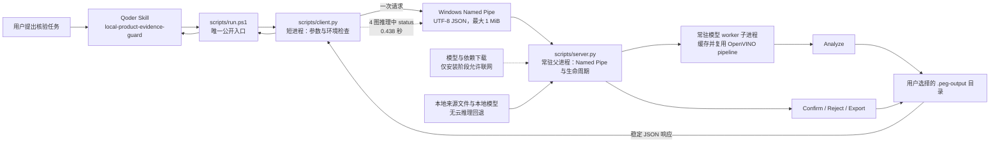
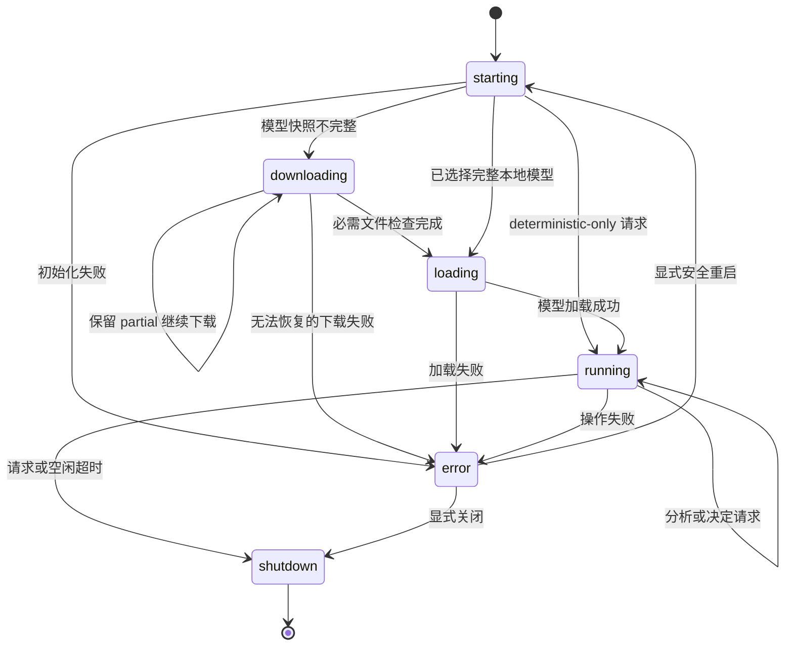
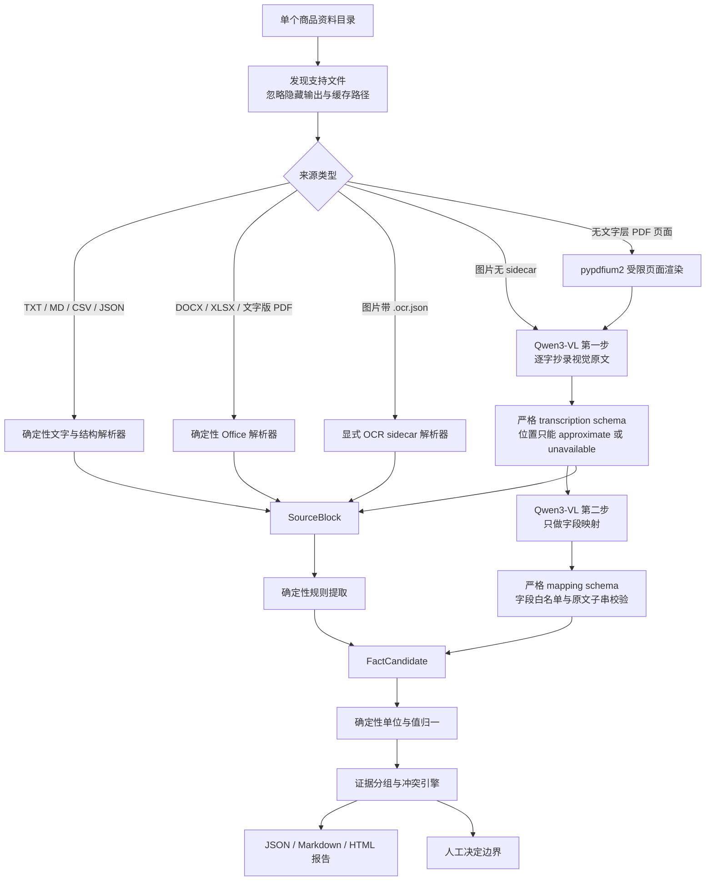
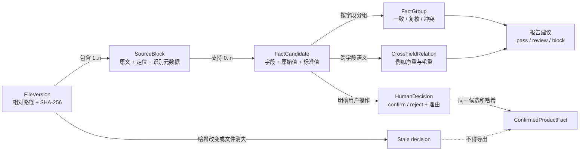
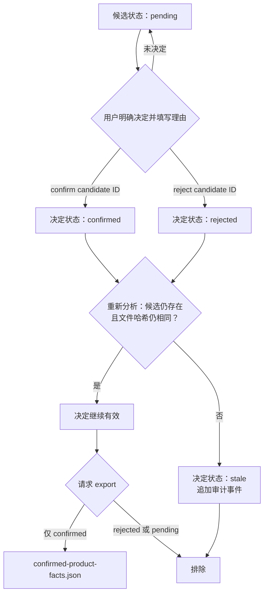

# Product Evidence Guard 架构设计

最后复核：2026-07-30

Product Evidence Guard 是一条本地证据核验管线。它的核心合同不是“让模型给
答案”，而是：

```text
正式事实
    ↑ 明确人工确认
事实候选 ← 证据块 ← 精确来源文件哈希
```

模型可以读取或映射证据；文件身份、schema 强制、单位归一、冲突分级、人工确认、
正式导出和版本失效都由确定性代码负责。

## 不可破坏的架构约束

1. `scripts\run.ps1` 是唯一公开宿主入口。
2. 用户来源文件只读；生成状态写入独立输出目录。
3. 能提取结构的 Office 文档走确定性解析器。
4. 图片和无文字层 PDF 页面在配置模型时使用所选本地 Qwen3-VL；未配置时明确
   报告跳过，不使用云端推理回退。
5. 视觉原文读取和字段映射是两次独立模型调用。
6. 原始模型输出在通过 JSON、schema、字段白名单、长度/数量和来源关联检查前
   都是不可信内容。
7. 单位换算与冲突分级不能依赖模型意见。
8. 没有明确选择和理由，候选不能成为正式事实。
9. 只有候选和来源文件哈希仍存在时，人工决定才有效。
10. “已实现”“单元测试通过”“真机验证”“Qoder 验证”和“离线验证”是不同
    结论。

## 1. Qoder 入口与本地服务

大型本地模型理应在多次短 Qoder 调用之间保持加载。公开 PowerShell 包装器启动
或联系短生命周期 client；client 通过 Windows Named Pipe 与常驻 server 交换
一次带认证的 UTF-8 JSON 请求。



Pipe 地址为 `\\.\pipe\local-product-evidence-guard`。协议使用共享 `authkey`、
协议版本和 request ID，并规定每条连接只处理一次请求：

```text
connect → 发送 UTF-8 JSON → 接收 UTF-8 JSON → close
```

server 支持 `status`、`analyze`、`confirm`、`reject`、`export` 和 `shutdown`。
退出码合同：

| 退出码 | 含义 |
|---:|---|
| `0` | 成功 |
| `1` | 参数、输入、权限、模型或操作等一般错误 |
| `2` | client/server 通信错误 |
| `3` | 模型仍在下载；需运行 `--continue` |

server 记录 PID 和进程启动标记，拒绝已经验证的重复实例，只清理 stale 身份文件，
并在配置的空闲时间（当前为 300 秒）后退出。不得因为进程名含 `python` 就模糊
终止其他进程。

真实 4 图模型推理期间执行公开 `run.ps1 status`，Named Pipe 在 0.438 秒返回
`running` 和 `available_operations`，响应没有 fallback 字段。因此父服务在模型
worker 推理期间并发响应状态请求已经验证。

### server 状态机



状态机和并发状态请求已在 Windows 公开入口验证；最终 123 项回归覆盖 authkey
不匹配、崩溃恢复、重复启动和 timeout。独立拒绝服务、进程冒充与渗透测试仍未
完成。

server 父进程管理独立的常驻模型 worker 子进程。worker 持有
`ResidentModelCache`，按模型路径与实际设备复用 `QwenVlReader`/
`VLMPipeline`。最终离线功能工件记录 `model_reused=false`、加载 3.6064 秒、
内层分析 57.1824 秒、外层 `analyze` 61.895 秒。更早的同模型同设备冷/热请求
记录 `model_reused=false/true`，热加载 0 秒、单图两步 30.8367 秒，因此模型
跨请求复用也已经真实验证。

## 2. 确定性解析与视觉处理分流

结构化来源走确定性路径。图片若明确提供 OCR sidecar 就读取 sidecar，否则在配置
本地模型后走 VLM。PDF 中没有文字层的页面会受限渲染后进入同一视觉路径。



严格两步实现位于 `qwen_vl_reader.py` 和 `model_output_schema.py`。它保留原文
transcription ID、近似位置、可读性、模型自评 confidence 来源、model ID 和
device。畸形输出只产生诊断，不产生候选。可选重试最多一次，而且只能修复 JSON
语法，不能把语义上非法的 schema “修”成事实。

旧 `OpenVinoImageTextReader` 是更简单的一阶段适配器，不能拿来满足最终两步比赛
工作流。主图片路径已使用 `QwenVlReader`，并完成真实模型冷/热公开入口验证。

主 engine 会检测 PDF 中未提取出文字的页面，用 `pypdfium2` 渲染到临时目录，
让视觉结果重新指向原始 PDF/页码，并删除临时图片。当前代码上限包括：

- 每任务最多 100 个文件；
- 单文件最大 100 MiB；
- 总提取文字最多 2,000,000 字符；
- PDF 最多 100 页；
- PDF 单页最多 25,000,000 个渲染像素；
- 直接图片最多 40,000,000 像素。

这些值尚未通过真实边界文件和恶意文件测试。父服务把 300 秒作为模型加载、每个
文件和最终化阶段各自的可信心跳边界；worker 未按时到达边界时，父服务会终止它
创建并精确跟踪的 worker。客户端对整个文件夹请求另设 1 小时上限，不按进程名
终止其他 Python。

## 3. Product Evidence Graph

证据图保留“候选为什么存在”及其依赖的来源版本。标准化值不会覆盖原值或定位。



### 核心记录

| 记录 | 关键字段 | 产生方 |
|---|---|---|
| `SourceBlock` | block ID、相对文件、文件哈希、类型、定位、原文、识别 confidence 及来源、提取方式、provenance | 解析器或通过校验的视觉读取器 |
| `FactCandidate` | candidate ID、白名单字段、原值与标准值、单位、source block ID、文件哈希、定位、mapping confidence 及来源、状态 | 规则提取或通过校验的 mapping |
| `FactGroup` | 字段、分类、严重度、candidate IDs、标准值、三类 confidence、解释与建议 | 确定性 graph engine |
| `CrossFieldRelation` | 相关字段、严重度、解释、candidate IDs | 确定性语义口径规则 |
| `HumanDecision` | session、candidate、动作、理由、来源文件/哈希、时间、工具版本 | 显式用户命令 |

当前冲突分类：

- `exact_match`
- `converted_match`
- `compatible_expression`
- `insufficient_evidence`
- `likely_version_update`
- `strong_conflict`

`pass` 只表示证据内部一致，不代表已经正式批准；`review` 需要人工判断；`block`
阻止自动选择真值。

## 4. 确认、导出与精准失效

人工决定属于某个分析 session 和 candidate。正式导出每次都从当前候选与当前
决定重建，而不是永久追加曾经确认过的值。



决定与导出必须提供同一个 `session_id`。确认和拒绝要求非空理由。
`confirmation-audit.jsonl` 记录决定及后续 stale。来源一旦改变，文件哈希和
candidate identity 会变化，旧决定不能静默存活。

## 增量分析

`analysis-state.json` 保存 engine signature，以及按相对路径记录的文件哈希和
序列化候选：

- engine signature 和文件哈希都相同：复用该文件候选；
- 新文件或哈希变化：只重新解析该文件；
- 路径删除：从新证据图移除其证据；
- 模型路径、VLM 路径、device 或工具版本签名变化：旧缓存整体失效；
- 来源候选改变或移除：相关决定变为 `stale`。

这是证据级失效。它不能证明供应商 revision 在业务语义上更新；文件名版本提示
仍只是 `review` 信号。

## 模型获取与设备边界

所选模型是 `OpenVINO/Qwen3-VL-8B-Instruct-int4-ov`。下载器写入 `.partial`
目录，保留以便续传，检查官方 26 文件清单的存在性、非空和 LFS pointer，再提升
为正式目录。运行时结构检查本身不是密码学验证；发布阶段已经固定 revision，并在
`<project-root>\release\model-sha256-manifest.json` 维护 26 payload 的逐文件
SHA-256。该清单尚未签名。

设备策略已经实现为：

1. 用户明确指定且 OpenVINO 报告可用的设备；
2. `FULL_DEVICE_NAME` 含 `Intel` 的可用 GPU；
3. CPU。

`AUTO` 会检查完整设备名；如果只有 NVIDIA GPU 与 CPU，就选择 CPU。显式设备会
先校验是否可见。该精确模型尚无 NPU 双重证据，所以显式 NPU 会被拒绝。本机真实
运行记录 `requested_device=CPU`、`device=CPU`；AUTO 选择策略已有单元测试，真实
AUTO 公开入口记录仍应在最终证据包中保留。官方兼容边界见
[`MODEL_AND_RUNTIME.md`](MODEL_AND_RUNTIME.md)。

## 输出边界

分析输出与来源分开，可能包含：

| 工件 | 用途 |
|---|---|
| `product-facts.json` | 完整候选图；顶层状态始终是 `pending_human_confirmation` |
| `conflicts.md` | 冲突、待复核和一致分组的人类可读报告 |
| `evidence-report.html` | 已转义的本地证据报告 |
| `run-summary.json` | 改变、复用、删除、跳过和失败文件及分组计数 |
| `analysis-state.json` | 增量缓存与 session 身份 |
| `confirmation-state.json` | 当前确认/拒绝/stale 状态 |
| `confirmation-audit.jsonl` | 本地 append-only 决定与失效事件 |
| `confirmed-product-facts.json` | 仅包含已确认且来源哈希仍有效的事实 |
| `visual-transcription.json` | 主路径写出的视觉原始、通过与拒绝记录；已保留一次 CPU 真实单图成功和一次截断拒绝工件 |

输出可能含机密来源片段，并非匿名化。隐私和安全边界见
[`PRIVACY.md`](../PRIVACY.md) 与 [`SECURITY.md`](../SECURITY.md)。

## 实现与验证边界

| 领域 | 状态 | 证据或缺口 |
|---|---|---|
| 确定性解析、规则、归一、graph、报告、增量缓存 | **已验证** | 最终本地回归 123 项通过，50.978 s；Windows 内部 123 项 49.864 s 及 JSON smoke 通过 |
| 确认、拒绝、当前哈希导出、stale reconciliation | **已完成** | 代码存在；完整公开入口商业 E2E 待执行 |
| 严格两步 Qwen 读取与输出 schema | **已验证** | CPU 冷/热真实图成功；扫描 PDF 和恶劣图片矩阵待测 |
| 模型 snapshot、结构与 SHA-256 | **已验证** | revision `f3d0bc7` 已加载；26 payload 清单已生成但未签名；中断续传 E2E 待测 |
| Named Pipe 父服务与常驻模型 worker | **已验证** | 模型复用；status/shutdown、认证失败、崩溃、重复启动与超时进入最终回归 |
| `run.ps1` 与短 client | **已验证** | 真实模型与并发 status 已验证；确认/stale E2E 待测 |
| pypdfium2、资源上限与阶段心跳 | **已完成** | 300 秒阶段边界与精确 worker 终止已实现；恶意 PDF 待测 |
| 输入、发布与 Qoder 链接防护 | **已验证** | symlink/junction/reparse point/hardlink 失败关闭合同进入最终回归 |
| Qoder Skill 发现 | **已验证** | CLI 1.1.8、用户级、`Enabled` |
| Qoder 自动/手动调用 | **待用户操作** | 账号未登录 |
| 离线环境变量推理 | **已验证** | 三个离线/遥测变量下成功；防火墙/抓包未执行 |
| Synthetic CPU Benchmark | **已验证** | commit `06f8360`；30 图、10 文档完成；不等于真实业务准确率 |

本文中的任何架构图都不能作为真实模型、Qoder、离线、Benchmark、CI 或 PR 已经
通过的证据。
