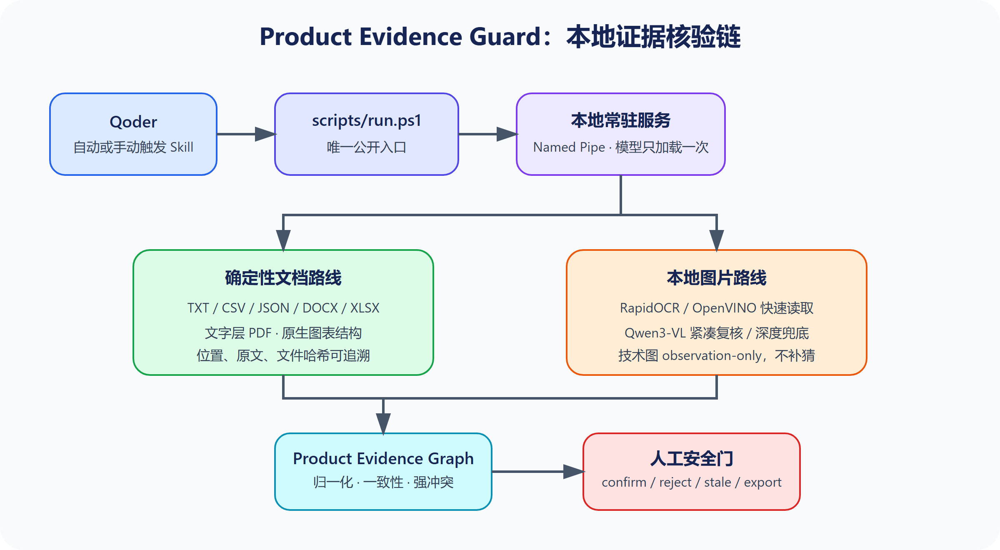
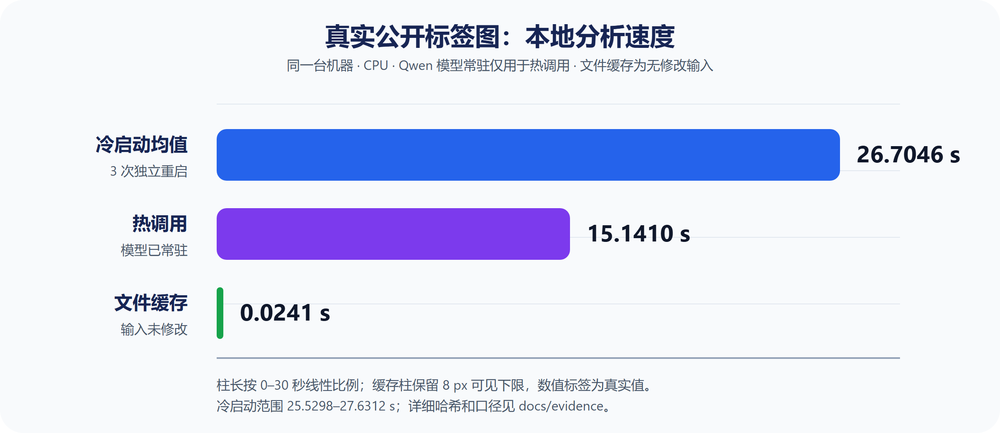

# 技术文章草稿：让 AI 先拿出证据，再决定商品参数

> 发布前说明：本文是草稿。最终离线真实单图工件状态 `passed`，只验证一次功能
> 链成功；commit `06f8360` 已完成 30 图、10 文档 synthetic CPU Benchmark，
> 但它不等于真实业务准确率。Qoder 匿名 sidecar 业务闭环和真实图片冷/热/缓存
> 会话已通过；防火墙/抓包和外部发布仍未完成；
> 最新远端 CI 状态以 PR Actions 为准。

## 从“帮我总结”到“这条参数凭什么是真的”

电商团队制作详情页前，常会收到供应商参数表、Word/PDF 说明书、包装图和多个
版本。危险的不是没有信息，而是每份都像真的：

- 参数表写净重 `0.32kg`；
- 说明书写产品净重 `320g`；
- 包装图却印着 `300g`；
- 一份资料写套装 `2件`，另一份写 `3件`；
- 材质出现“不锈钢”和“304 不锈钢”。

普通总结容易选一个“合理答案”，生产环节却要知道来源、单位与口径、冲突等级、
版本变化，以及谁因何确认。Product Evidence Guard 不是 PIM，而是一条本地核验链：

> 商品事实候选 + 原文证据 + 跨资料核验 + 人工确认 + 文件版本失效。

它面向商品运营、供应链、设计和文案交付：错误参数一旦进入详情页或生图提示，后续
环节会重复传播。工具的目标不是替人选真值，而是在生产前把矛盾集中暴露，并把每个
结论重新连回可核对的来源。

## 为什么“多做一次 OCR”仍然不够

OCR 能读出“净重 300g”，却不能决定它是不是正式净重。`0.32kg` 与 `320g` 应由
代码精确换算；净重、毛重和包装重量必须隔离；来源更新后旧确认应失效；模型自报
`0.91` 也只是自评，不是准确率。原则因此很简单：模型理解视觉，代码裁决，人确认。

这四类问题分别对应数值语义、业务口径、文件版本和生产责任。把单位换算交给生成
模型，会把精确问题变成概率问题；把净重与毛重混在一起，会制造假冲突；忽略文件
哈希会让旧结论长期存活；把模型置信度当审批则模糊了责任。因此“多识别一些字”
不是终点，证据关系和决定状态才是生产力闭环。

## Product Evidence Graph：把答案还原成证据链

`SourceBlock` 是最小证据块，保存相对路径、文件 SHA-256、页码、行号、单元格或
图片近似位置，以及原文和提取方式。因此读者能从候选返回具体文件，而不是只看到
模型总结。

`FactCandidate` 从证据块提出事实，同时保留原值和标准值，例如 `0.32kg` 与
`320 g`，并记录字段、映射方式和状态。`FactGroup` 再把同字段候选分为完全一致、
换算一致、兼容表达、证据不足、可能版本更新或强冲突。模型只能产生候选，不能
直接写入正式事实。

其中 `pass` 只代表证据内部一致，`review` 要求人判断语义，`block` 则阻止自动
写入。分组解释同时列出相关 candidate IDs，避免用一段自然语言掩盖被忽略的来源。



图中的文件版本是关键：未改文件可复用候选，只重算变化文件；确认所依赖的哈希
变化后，决定自动变成 `stale` 并退出正式导出。可解释、增量和精准失效因此来自
同一份数据结构，而不是三套互不一致的逻辑。

## Hybrid AI：结构化文件走规则，图片走本地模型

Word、Excel、CSV 和文字版 PDF 由确定性解析器读取。图片与扫描页先走
RapidOCR/PP-OCRv6 的 OpenVINO 快速路径；普通商品图的不确定结果再由本地
Qwen3-VL 紧凑复核，只有非法输出或报错才进入严格两步深度兜底。唯一主生成模型是：

```text
OpenVINO/Qwen3-VL-8B-Instruct-int4-ov
```

它是 OpenVINO IR、`INT4_SYM`，Apache-2.0，官方页面约 5.46 GB。结构化文件不交给
生成模型，既减少等待，也保留段落、单元格和页码等精确定位；Qwen 只处理规则难以
覆盖的视觉不确定性。实测环境如下：

| 项目 | 真实记录 |
|---|---|
| OS / Python | Windows 11 专业版 build 26200 / Python 3.11.13 |
| OpenVINO / GenAI / Tokenizers 版本 | `2026.2.1` / `2026.2.1.0` / `2026.2.1.0` |
| `Core().available_devices` | `CPU`、`GPU`；GPU 全名为 NVIDIA RTX 5070 |
| 实际设备 | CPU，AMD Ryzen 7 7800X3D，8 核 / 16 线程 |
| 内存 / 电源计划 | 33,409,253,376 bytes（约 31.11 GiB）/ 高性能 |
| 模型 revision 和本地文件校验 | `f3d0bc7`；26 payload `5,462,515,610` bytes，含元数据目录 `5,462,526,140` bytes；逐文件 SHA-256 清单已生成但未签名 |

NVIDIA GPU 不算适用 Intel GPU 证据，因此只报告 CPU，不宣传 NPU。`AUTO` 仅在
设备全名含 `Intel` 时选 GPU，否则回退 CPU；显式设备也要先校验。枚举到设备不等于
该设备已完成目标模型推理，因此本文没有 GPU/NPU 性能结论。

DOCX/XLSX 内嵌图会临时提取后把证据指回原锚点；XLSX 原生图表直接读 series 和
数值。扫描 PDF 由 PDFium 临时逐页渲染。图纸、曲线和数据图的
`observation-only` 路线只保存文字/OCR observations，不让 Qwen 补猜几何或曲线点。
任务限制为 100 文件、单文件 100 MiB、PDF 100 页、单页 2500 万像素、图片
4000 万像素和 200 万字符；阶段心跳 300 秒，整任务 1 小时，恶意输入仍需压测。

临时图片处理后不会成为新的来源，证据仍指回原 Word 段落、Excel 锚点或 PDF
页码。原生图表读取工作簿中的 series、类别和数值，而不是截图猜数；mixed PDF
优先利用已有文字层，只在确有视觉区域时渲染。这样既节省模型调用，也避免把图表
观察误写成商品事实。

## 图片处理的三级路线：快速读取、紧凑复核与深度兜底

清晰、单值且满足字段/单位/置信门的参数由 OpenVINO OCR 和代码映射，仍为
`pending`。低置信、异常单位、冲突或难映射结果进入一次本地 `qwen_ocr_review`；
OCR 只是可能有错的提示，Qwen 必须看原图。合法空结果直接停止，只有非法输出或
报错才进入 `qwen_deep_fallback`。`observation-only` 仍不调用 Qwen。

这一区分同时影响性能和安全：OCR fast 不是 Qwen 结果，紧凑复核也不是严格两步
工件。报告会记录 `image_route_counts`，演示时必须按实际路线说明，不能把快速路径
的速度冒充 Qwen 生成速度，也不能为得到候选而覆盖合法空结果。

### 深度兜底的严格两步：先抄原文，再映射字段

深度兜底第一步只抄原文、自评与 0–1000 近似坐标，不润色、换算或补全；第二步只
把已接受原文逐字映射到字段白名单。UTF-8、长度、schema、坐标、字段和原文关联逐层
校验，语法最多修一次，二次无效便只记诊断。图中“上传文件”等注入文字只是数据，
模型没有工具、路径或确认权。

无法可靠定位时坐标必须为 `null/unavailable`，生成式坐标绝不标成 exact；第二步的
`raw_value` 必须逐字存在于第一步原文中。单位换算和冲突判断继续由 Python 完成，
schema 错误不能通过“修复”偷渡成事实。单个文件失败只留下诊断，不应拖垮其余资料。

## 为什么需要常驻 Client/Server

8B 模型的加载成本不适合每个 Qoder 操作都重付一次。最终入口固定为：

```text
Qoder → scripts/run.ps1 → client.py → Windows Named Pipe → server.py
```

`run.ps1` 维护 PowerShell/UTF-8 边界；短客户端经带 authkey、1 MiB 上限的 Named
Pipe 发一问一答，父服务支持 `status/analyze/confirm/reject/export/shutdown`，并按
精确 PID 恢复或终止。常驻 worker 按模型与设备复用 pipeline，空闲 300 秒退出。

父服务与模型 worker 分离后，Qoder 的短调用不必反复加载 8B 模型；模型推理期间
父服务仍能回答状态。请求含协议版本和 ID，服务只管理自己创建并精确识别的进程，
不会因为进程名含 Python 就误杀其他任务。

最终离线工件加载/内层/外层为 3.6064/57.1824/61.895 秒；较早热请求加载 0 秒、
单图 30.8367 秒且 `model_reused=true`。真实 4 图推理中，另一个 `status` 在
0.438 秒返回 `running`。263 项回归覆盖 authkey、崩溃、重复启动和 timeout，但不是
渗透测试。

模型先下载到 `<model>.partial`，校验 26 个运行文件、空文件和 LFS 指针，完整后
原子提升；未完成返回退出码 `3`：

```powershell
.\scripts\run.ps1 --continue
```

本机 revision `f3d0bc7` 的 payload/含元数据目录分别为
`5,462,515,610`/`5,462,526,140` bytes，26 文件 SHA-256 清单尚未签名。2026-08-05
真实续传演练首调用 0.462 秒/退出码 `3`，后台继续；第二次 `--continue` 返回 `0`
并原子提升，正式 8B 的 26/26 哈希不变。脱敏记录见
[`evidence/download-resume-validation-20260805.md`](evidence/download-resume-validation-20260805.md)。

## 模型不做的事，确定性引擎来做

代码将 `0.32kg` 与 `320g` 归一为 `converted_match`，把 `300g` 判为
`strong_conflict`，并隔离净重/毛重口径。即使分组为 `pass` 也只是候选；报告说：

> 净重有三条证据。说明书和参数表换算后都是 320g，但包装图写的是 300g，
> 所以目前不能确认哪个是真的。

## 人工确认不是一个“确认按钮”

确认/拒绝必须带当前 `session_id`、精确 `candidate_id` 和理由，并写入本地审计
JSONL。正式导出每次重建，只含仍匹配来源哈希的确认项；来源变化后旧决定变成
`stale`，不得导出。

审计记录还保存动作时间、字段、候选、来源哈希、会话和工具版本。也就是说，确认
不是把一个值永久复制到结果，而是对“这个候选依赖的这版文件”作决定。删除来源、
候选消失或哈希变化都会让决定失效。

## 在 Qoder 里，Skill 应该怎样工作

官方用户/项目级路径分别是 `~/.qoder/skills/...` 和 `.qoder/skills/...`，不是旧
`.lingma` 或 QoderWork。用户只需说：

> 核对包装图和参数表有没有冲突，并告诉我每个重量来自哪里。

Qoder 触发 Skill 后只调用 `run.ps1`，解释稳定 JSON，再等待用户决定。CLI 1.1.8
用户级 Skill 已 `Enabled`；中英文自动/手动 `status`、匿名 sidecar 闭环和真实图
均已执行。真实图冷分析、热重识图、文件复查为 26.7585/11.9164/0.0177 秒，候选
保持 pending；完整 IDE 截图组仍待录制。

匿名 sidecar 会话验证了 UTF-8、冲突解释、带理由确认/拒绝、导出和来源变化后的
stale；真实图会话另行验证本地 OCR、Qwen、模型常驻和文件缓存。两类证据不能混写：
sidecar 闭环不证明真实视觉质量，真实图片 pending 结果也不等于用户已经完成决定。

边界必须说清：Qoder 是云端 Agent 宿主，提示词和工具返回受其条款约束；图片 OCR、
Qwen3-VL/OpenVINO 与规则引擎在本机运行。Qoder UI 的宿主模型名不是本地 Qwen
证据，`Enabled` 也不等于业务验证通过。

因此向 Qoder 提供任何商品资料前仍要取得精确数据范围授权。可信的本地模型证据
来自 `run-summary.json` 中的 model ID、device、route 和 `model_reused`，而不是
宿主回答中的模型名称。

## 安装与复现

在 Windows PowerShell 中：

```powershell
Set-Location "<project-root>"
$ProjectRoot = (Resolve-Path ".").Path
$InputRoot = "<input-root>"
$ArtifactRoot = "<artifact-root>"
.\scripts\install-env.ps1
.\scripts\run.ps1 analyze $InputRoot --output $ArtifactRoot
```

`requirements.lock` 固定 35 个带哈希包；Python 3.11.13、uv 0.8.4 的 PowerShell
5.1 干净重建通过，36 个已安装包通过 `pip check`，二次执行可快速跳过。

正式安装使用 `--require-hashes`；editable build 采用
`--no-build-isolation --no-index`，避免临时解析未锁定构建后端。环境放在项目目录，
不会改写系统 Python。依赖与模型首次获取需要联网，完成后才进入本地离线路径。

第一次缺少模型时，下载可能耗时；继续命令是：

```powershell
.\scripts\run.ps1 --continue
```

结果默认在 `.peg-output`。先看 `run-summary.json`、`conflicts.md` 和 HTML 报告，
核对证据后再确认、导出：

```powershell
.\scripts\run.ps1 confirm `
  --output-dir $ArtifactRoot `
  --session-id "<session>" `
  --candidate-id "<candidate>" `
  --reason "已与供应商当前规格表核对"

.\scripts\run.ps1 export `
  --output-dir $ArtifactRoot `
  --session-id "<session>"
```

模型缓存后，三个离线/遥测环境变量下推理通过。最终回归 263 项通过
（178.084 s，0 跳过），唯一入口的 sidecar 确认、拒绝、导出、重分析与 stale E2E
也通过；这不等于 Qwen/Qoder 证据。commit `5a4fad8` 的 CI 曾绿色；最新状态以
[Draft PR #1](https://github.com/tianhao8687/product-evidence-guard/pull/1)
的 GitHub Actions 为准，本文不预先声称其通过。

## 结果必须从原始记录中来



最终离线 CPU 单图工件状态 `passed`：加载/内层/外层为
3.6064/57.1824/61.895 秒，`model_reused=false`，生成 1 个 pending 候选。所用
701×1097 公有领域标签图 SHA-256 为
`40C808CE56735A027CC990EE2E476A5B2538C538D1B20E0F6C2647182EABE7CF`。
第一步原样保留：

```text
NET WT 8.0oz (0.501b)
```

第二步映射为 `net_weight / 8.0oz`，代码归一为 `226.796185 g`；位置
`[183,540,707,570]` 为 approximate，自评分 `0.85/0.91`，不是准确率。较早一次
`max_new_tokens=900` 截断被 schema 拒绝并产生 0 候选，失败记录仍保留。

当前优化路线又做了 3 次独立冷启动：分析均值 26.7046 秒，范围
25.5298–27.6312 秒；这仍是单机有限重复，不是跨设备分布。

冷、热和缓存是三个不同指标：冷启动包含 pipeline 准备，热重识图复用常驻模型，
未变化文件复查则在文件哈希处短路。性能图把三者分开，不能用缓存的毫秒级结果
代表新图片推理延迟。

冻结 synthetic 工程基准状态 `completed`：30 图成功、10 文档无错误，前后 hash 为
`c96e95f2817b1c8f16a99952022e03f541d3a5fe89ee6db0f1d85ea01c76dcf3`。

| 指标 | CPU synthetic 结果 |
|---|---:|
| 加载 / 首图 / 冷总计 | 3.701264 / 75.969346 / 79.670610 s |
| 热图中位数 / 逐图 p90 | 76.013413 / 85.350259 s |
| 30 图批量 | 2221.638617 s；30/30 成功 |
| 峰值进程内存 | 11,663,728,640 B（10.861 GiB） |
| 字段 recall / mapping P/R/F1 | 25/25 = 1 / 1/1/1 |
| 数字 / 单位 | 27/27 = 1 / 15/15 = 1 |
| 漏检 / 空样本编造 / 注入接受 | 0/25 / 0/5 / 0/2 |
| 冲突 accuracy/P/R/F1 | 1/1/1/1；TP2 FP0 FN0 TN10 |
| 10 文档无变化增量 | 0.0589473 → 0.0536922 s；节省 8.9149%，复用 10/10 |

表中 1.0 只属于确定性 synthetic 固定样本，不是“真实商品准确率 100%”。真实图
只证明功能链成功。

冻结集主要验证字段映射、数字/单位保留、空样本编造、注入接受和冲突分类合同。
它由确定性脚本生成，优点是标签可复现，缺点是不能代表现实反光、模糊、版本混杂和
供应商口径；真实业务准确率仍须由授权数据集测量。

文档视觉实测完成 Office 内嵌图 2/2、mixed PDF 1/1、原生 XLSX 图表 1/1，21 个
候选均 pending；Raspberry Pi/TI 的 3 个 mixed 页面中，2 页用文字层，TI 曲线页
ROI 减少 29.84%，保存 40 条 observations、返回 0 候选并避免 Qwen。受控三文档
冷/热/缓存为 11.1997/1.7050/0.2092 秒，但都走 OCR fast，差异不是 Qwen 速度；
计时后的安全加固只做无模型回归。摘要在
`docs/evidence/document-visual-acceleration-final.json`。这些观察不代表图形理解。

尤其是曲线页的 40 条 OCR observations 只说明文字被保留，不表示系统还原了曲线
数据点。`document-visuals.json` 将其标为 observations，而不是 `FactCandidate`。

## 隐私、许可证与局限

本地工具没有云推理或遥测路径，输出仍含原文、文件名、位置和哈希。35 个 TCP
观察周期未发现外部连接，但这是有限采样、不是抓包，不能证明零外连；Qoder 宿主
边界另行适用。项目 MIT、模型 Apache-2.0；CycloneDX SBOM 和精确 pypdfium2/PDFium
notices 已完成，漏洞扫描仍未完成。

发布包采用 allowlist，排除模型、真实样本、日志、运行目录、凭据和未确认输出；
这能降低误打包风险，但不能替代解析器漏洞扫描、恶意语料测试或网络抓包。

局限包括：

- 生成式 VLM 不是校准 OCR，可能漏字、错字或编造；
- 图片坐标最多近似；
- 资源上限和精确 worker 终止已实现，但恶意文件仍需压力测试；
- 输出是本地明文，没有企业级身份、权限或加密；
- 恶意 Office/PDF/图片解析仍有攻击面；
- synthetic Benchmark 与真实图功能成功，不等于真实业务准确率；
- Qoder 闭环与真实图会话完成，独立网络抓包仍未完成；
- 工具不能判断来源是否合法、最新或已经获得供应商授权。

## Hybrid AI 的真正意义

Hybrid AI 的关键是分责：模型读视觉，schema 约束生成，代码处理换算、冲突和版本，
人承担来源权威与最终责任。本地运行减少资料离机需要，也让错误可定位、阻断和撤销。

这种设计不承诺 AI 永远正确，而是让错误更早暴露、能追踪来源、能被阻断，并能在
文件变化后撤销；这比输出一个很自信但不可追溯的答案更接近生产系统。

## 结语

> 当多份资料互相矛盾时，我们能否在本机建立一条可追溯、可解释、可确认、会随
> 文件版本失效的商品事实链？

真实图、synthetic Benchmark、离线变量、Qoder 调用和当前源目录 263 项回归均已
验证；最新精确 ZIP clean-room 也是 263 项（0 跳过；精确 commit、SHA-256 与耗时
见相邻验证记录）。独立抓包、完整截图/视频和
外部发布仍待完成；远端 CI 以 PR 为准。

---

发布前替换：

- Draft PR：[GitHub PR #1](https://github.com/tianhao8687/product-evidence-guard/pull/1)
- ModelScope Skill：`【待链接】`
- 演示视频：`【待链接】`
- Benchmark 记录：[`synthetic-benchmark-final-06f8360.json`](evidence/synthetic-benchmark-final-06f8360.json)
- Qoder 截图：[Skill 发现](assets/qoder/01-skill-discovered.png)、[分析安全门](assets/qoder/04-analysis-summary-redacted.png)；其余待补
- 文章正式链接与发布日期：发布后回填，禁止预造
