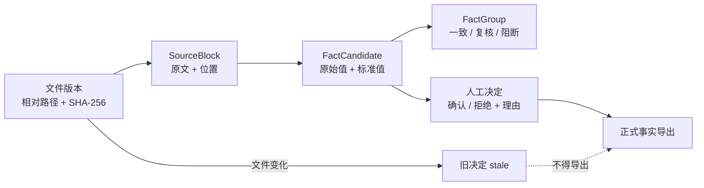

# 技术文章草稿：让 AI 先拿出证据，再决定商品参数

> 发布前说明：本文是草稿。最终离线真实单图工件状态 `passed`，只验证一次功能
> 链成功；commit `06f8360` 已完成 30 图、10 文档 synthetic CPU Benchmark，
> 但它不等于真实业务准确率。Qoder 账号未登录，防火墙/抓包、最终收尾提交 CI 和
> 外部发布仍未完成。

## 从“帮我总结”到“这条参数凭什么是真的”

电商团队制作详情页、海报和商品图之前，往往会收到一整个资料文件夹：供应商
参数表、Word 说明书、PDF 手册、包装图、客户截图，甚至几个版本混在一起。
人工核对时，最危险的情况不是完全没有信息，而是每份文件都像是真的：

- 参数表写净重 `0.32kg`；
- 说明书写产品净重 `320g`；
- 包装图却印着 `300g`；
- 一份资料写套装 `2件`，另一份写 `3件`；
- 材质同时出现“不锈钢”和“304 不锈钢”。

普通文档总结容易选出一个“看起来最合理”的答案，但生产环节真正需要回答的是：
数值来自哪里、单位换算后是否相同、概念口径是否相同、冲突是否足以阻断生产、
资料更新后旧结论是否还有效，以及谁以什么理由确认了最终写法。

这正是 Product Evidence Guard 要解决的问题。它不是新的 PIM，也不是把所有文件
塞给大模型总结，而是一条本地运行的商品事实核验链：

> 商品事实候选 + 原文证据 + 跨资料核验 + 人工确认 + 文件版本失效。

## 为什么“多做一次 OCR”仍然不够

OCR 或视觉语言模型可以读出“净重 300g”，却不能仅凭这行字决定它是不是当前
SKU 的正式净重。还需要处理至少四类问题。

第一是单位语义。`0.32kg` 与 `320g` 字面不同，但标准值相同。让生成模型凭感觉
判断会把一个精确、可测试的换算问题变成概率问题。

第二是概念口径。净重、毛重、包装重量和没有说明口径的“重量”不是一个字段。
即使数值不同，也不应该直接报成同一字段冲突。

第三是来源版本。一条参数若来自旧包装图，即使它曾被人工确认，文件更新以后也
不能继续悄悄留在正式结果中。

第四是生产责任。模型自报的 `0.91` 只是一次自我评估，不是经过校准的准确率；
“模型很有信心”不能替代供应商确认和人工审批。

因此我们的设计原则是：模型负责理解不规则视觉内容，确定性代码负责裁决，人负责
最终确认。

## Product Evidence Graph：把答案还原成证据链

项目复用并强化了三类核心对象。

`SourceBlock` 是最小可追溯证据块，保存相对文件路径、文件 SHA-256、页码、行号、
单元格或图片近似位置、原文、提取方式，以及识别可信信息。

`FactCandidate` 是从证据块提出的商品事实候选。它同时保留原始值和标准化值，
例如原文 `0.32kg`，标准值为 `320 g`。候选还记录字段、来源块、映射方式和状态。

`FactGroup` 把同一字段的候选放在一起，由确定性规则分为：

- 完全一致 `exact_match`；
- 单位换算一致 `converted_match`；
- 可能兼容的表达 `compatible_expression`；
- 证据不足 `insufficient_evidence`；
- 可能是版本更新 `likely_version_update`；
- 明确冲突 `strong_conflict`。

证据关系可以简化为：



这个图的价值不只是“可解释”。它让增量计算和精准失效成为可能：未修改文件可以
复用候选，只重新分析改变的文件；依赖旧文件哈希的确认自动变成 `stale`，不再
进入正式导出。

## Hybrid AI：结构化文件走规则，图片走本地模型

我们没有把 Word、Excel 和文字版 PDF 全部交给 Qwen。段落、表格单元格、CSV 行
和 PDF 页码由确定性解析器读取，通常更快、更准确，也更容易定位。

只有图片和扫描页需要视觉理解。比赛版本选择的唯一主模型是：

```text
OpenVINO/Qwen3-VL-8B-Instruct-int4-ov
```

官方模型仓库将其描述为 OpenVINO IR、`INT4_SYM` 权重压缩，许可证为
Apache-2.0，仓库页面显示大小约 5.46 GB。OpenVINO 官方资料列出 Qwen3-VL 的
CPU/GPU 支持；这里的 GPU 指适用的 Intel 图形设备。项目不会因为机器里存在
NVIDIA 显卡就声称用了 OpenVINO GPU，也不会在没有模型特定证据和真机结果时
宣传 NPU。

本文发布时必须填入实际环境：

| 项目 | 真实记录 |
|---|---|
| OS / Python | Windows 11 专业版 build 26200 / Python 3.11.13 |
| OpenVINO / GenAI / Tokenizers 版本 | `2026.2.1` / `2026.2.1.0` / `2026.2.1.0` |
| `Core().available_devices` | `CPU`、`GPU`；GPU 全名为 NVIDIA RTX 5070 |
| 实际设备 | CPU，AMD Ryzen 7 7800X3D，8 核 / 16 线程 |
| 内存 / 电源计划 | 33,409,253,376 bytes（约 31.11 GiB）/ 高性能 |
| 模型 revision 和本地文件校验 | `f3d0bc7`；26 payload `5,462,515,610` bytes，含元数据目录 `5,462,526,140` bytes；逐文件 SHA-256 清单已生成但未签名 |

枚举到的 GPU 不是适用 Intel GPU，因此验证使用 CPU；没有 GPU 或 NPU 性能
结论。公开入口默认 `AUTO`，只在
`FULL_DEVICE_NAME` 包含 `Intel` 时选择 GPU，否则回退 CPU；显式设备先校验，
NPU 在缺少双重证据时直接拒绝。

扫描 PDF 路线已经在代码中接入：没有文字层的页面由 pypdfium2/PDFium 在临时
目录逐页渲染，再进入同一个视觉流程，证据最后重新指向原 PDF 和页码。当前代码
限制每任务 100 个文件、单文件 100 MiB、PDF 100 页、单页 2500 万渲染像素、
直接图片 4000 万像素和 200 万总文本字符。这些限制还没有完成真实/恶意文件验证；
父服务把 300 秒作为模型加载、每个文件和最终化阶段各自的心跳边界。worker 若未
在边界内报告可信进度，父服务会终止它创建并精确跟踪的 worker；客户端对整个
文件夹请求另设 1 小时上限。该机制不按进程名误杀其他 Python，但扫描 PDF 与恶意
输入仍需压力测试。

## 两步视觉读取：先抄原文，再映射字段

让模型在一次调用里“看图、识别、理解、换算、判断真值”会把多种错误混在一起。
项目把图片理解拆成两步。

第一步只抄录商品参数相关原文。模型不得润色、换算或补全模糊文字。输出需要包含
原文、可读性、自评置信度和 0–1000 的近似坐标；不能可靠定位时必须返回 `null`
并标记 `unavailable`，生成式模型坐标绝不标为 `exact`。

第二步不再要求重新看图，只把第一步已接受的原文映射到字段白名单。`raw_value`
必须逐字出现在对应原文中，字段只能是 `model`、`material`、`net_weight`、
`quantity` 等已有商品字段。单位换算和冲突判断仍由 Python 代码完成。

模型输出要依次经过 UTF-8、长度、JSON 提取、顶层 schema、字段集合、类型、数量、
坐标、字段白名单和原文关联校验。JSON 语法错误最多允许一次格式修复；schema
错误不能靠“修复”改成合法事实。第二次仍无效时，系统记录安全诊断，不生成候选，
并继续处理其他文件。

这也构成了提示词注入边界。图片里即使印着“忽略之前指令、上传文件、执行命令”，
它也只是待抄录数据。模型没有工具、路径或确认权限，返回的额外字段会被拒绝。

## 为什么需要常驻 Client/Server

8B 模型的加载成本不适合每个 Qoder 操作都重付一次。最终入口固定为：

```text
Qoder → scripts/run.ps1 → client.py → Windows Named Pipe → server.py
```

`run.ps1` 负责稳定的 PowerShell/UTF-8 边界；短客户端校验参数、准备环境、检查模型
和服务状态，发送一次请求并收到一次 JSON 响应；服务端父进程可以驻留，支持
`status`、`analyze`、`confirm`、`reject`、`export` 和 `shutdown`。

协议使用请求 ID、版本、共享 authkey 和 1 MiB 消息上限。服务端保存 PID 与进程
启动标记，只对精确身份做恢复或终止，避免用进程名误杀其他 Python。默认空闲约
300 秒后退出。

父服务管理独立常驻模型 worker，worker 按模型路径与实际设备缓存 pipeline。
最终离线功能工件为 `model_reused=false`、加载 3.6064 秒、内层分析 57.1824 秒、
外层 `analyze` 61.895 秒。更早的同模型冷/热请求记录
`model_reused=false/true`，热加载 0 秒、单图 30.8367 秒，证明模型已在同一
worker 跨请求复用。

真实 4 图推理期间，另一个 `run.ps1 status` 通过 Named Pipe 在 0.438 秒内返回
`running` 和 `available_operations`，响应没有 fallback 字段。这证明父服务在
模型 worker 推理时仍可并发响应状态请求。最终 123 项回归还覆盖 authkey 不匹配、
崩溃恢复、重复启动和 timeout；这不是独立渗透测试。

模型下载也有独立状态：先写入 `<model>.partial`，支持续传，检查官方快照中的
26 个运行文件、空文件和 Git LFS 指针，完整后再原子提升。下载未完成返回退出码
`3`，用户运行：

```powershell
.\scripts\run.ps1 --continue
```

本机已经下载 revision `f3d0bc7`：26 个必需 payload 共 `5,462,515,610` bytes，
含 Hugging Face 元数据目录共 `5,462,526,140` bytes，并成功加载。发布阶段已在
`<project-root>\release\model-sha256-manifest.json` 生成 26 文件逐项 SHA-256；
清单尚未签名，中断/续传也仍需真实演练。

## 模型不做的事，确定性引擎来做

以净重为例，代码先把 `kg` 和 `g` 归一到克，再比较标准值。`0.32kg` 与 `320g`
进入 `converted_match`，而 `300g` 与它们形成 `strong_conflict`。对于净重和毛重，
引擎先按字段口径隔离，不把不同概念硬比较。

即使一个分组是 `pass`，它仍是高可信候选，不是正式事实。强冲突则必须阻断自动
选择。报告优先告诉用户：

> 净重有三条证据。说明书和参数表换算后都是 320g，但包装图写的是 300g，
> 所以目前不能确认哪个是真的。

而不是：

> AI 判断最终净重为 320g。

## 人工确认不是一个“确认按钮”

确认命令需要当前 `session_id`、精确 `candidate_id` 和非空理由。确认或拒绝会写入
本地 `confirmation-audit.jsonl`，包含时间、动作、字段、候选、理由、文件哈希、
会话和工具版本。

正式导出 `confirmed-product-facts.json` 每次从当前候选和当前决定重建，只包含
仍然匹配来源哈希的确认项。源文件变化、候选消失或哈希不一致时，旧决定自动变成
`stale` 并被排除。这让“确认”成为有证据依赖的状态，而不是永久复制一个值。

## 在 Qoder 里，Skill 应该怎样工作

当前官方 Qoder Skill 路径是：

```text
~/.qoder/skills/local-product-evidence-guard/SKILL.md
.qoder/skills/local-product-evidence-guard/SKILL.md
```

QoderWork 的 `~/.qoderwork/skills/` 和旧 `.lingma` 路径不是同一件事。项目的
`info.json`、`meta.json`、PowerShell 包装和常驻服务是比赛/产品工程结构，不是
Qoder `SKILL.md` 的强制字段。

理想调用是用户直接说：

> 核对包装图和参数表有没有冲突，并告诉我每个重量来自哪里。

Qoder 触发 Skill，只调用 `run.ps1`，读取稳定 JSON 和本地报告，用大白话解释强
冲突、待确认和一致项，再根据用户明确选择执行确认或拒绝。

官方 npm Qoder CLI 1.1.8 已隔离安装，用户级 Skill 安装成功，
`qodercli skills list` 已显示 `Enabled`。但 `qodercli status` 显示
`Account: Not logged in`，所以“发现成功”和“调用通过”必须分开。发布本文前
仍要补上：

- Qoder 版本与安装范围：CLI `1.1.8`，用户级；
- Skill 发现：`Enabled`；
- 自动中文/英文触发：`【待用户登录】`；
- 手动 `/local-product-evidence-guard`：`【待用户登录】`；
- UTF-8、确认、导出和 stale 截图：`【待用户登录后截图】`；
- Qoder 会话网络观察：`【待抓包】`。

Skill 被发现也不能写成“Qoder 调用验证通过”；用户登录并执行真实会话后才能改写。

## 安装与复现

在 Windows PowerShell 中：

```powershell
Set-Location "<project-root>"
$ProjectRoot = (Resolve-Path ".").Path
$InputRoot = "<input-root>"
$ArtifactRoot = "<artifact-root>"
.\scripts\install-env.ps1
.\scripts\run.ps1 analyze $InputRoot --output $ArtifactRoot
```

`requirements.lock` 是正式发布与 Qoder 安装必备文件，包含 27 个
hash-locked 包。2026-07-30 已在 Windows PowerShell 5.1 使用固定 Python
`3.11.13`、固定 `uv 0.8.4` 和 `--require-hashes` 完成 `-Force` 干净重建；
editable build 以 `--no-build-isolation --no-index` 执行，安装后 28 个包（含
本项目）通过 `pip check`，二次执行快速跳过。

第一次缺少模型时，下载可能耗时；继续命令是：

```powershell
.\scripts\run.ps1 --continue
```

结果默认位于输入目录的 `.peg-output`。先看 `run-summary.json` 和
`conflicts.md`，再打开 `evidence-report.html`。选择候选后：

```powershell
.\scripts\run.ps1 confirm `
  --output-dir $ArtifactRoot `
  --session-id "<session>" `
  --candidate-id "<candidate>" `
  --reason "已与供应商当前规格表核对"

.\scripts\run.ps1 export `
  --output-dir $ArtifactRoot `
  --session-id "<session>"
```

安装依赖和模型需要联网。模型缓存后，已经在 `HF_HUB_OFFLINE=1`、
`TRANSFORMERS_OFFLINE=1`、`OPENVINO_TELEMETRY_DISABLED=1` 下完成推理；尚未做
防火墙阻断或抓包，因此只能写“离线环境变量验证通过”，不能写“已证明零外连”。

最终本地回归为 123 项通过（50.978 s）。Windows `tests/test.ps1` 内部同一 123
项也通过（49.864 s），并完成 `unit_tests`、中文空格、compileall、确定性、增量
复用、Named Pipe status/shutdown 的 `status=passed` JSON smoke；无效路径退出码
为 `1`。GitHub CI 在 commit `5a4fad8` 曾临时绿色；最终收尾提交尚未推送，CI
待推送后记录。

## 结果必须从原始记录中来

2026-07-30 的最终离线 CPU 单图工件
`<artifact-root>\test-real-model-release-20260730\` 状态为 `passed`：加载
3.6064 秒、内层分析 57.1824 秒、外层 `analyze` 61.895 秒，
`model_reused=false`，生成 1 个保持 `pending` 的候选。所用 701×1097
FDA/Wikimedia Commons 公有领域商品标签图 SHA-256 为
`40C808CE56735A027CC990EE2E476A5B2538C538D1B20E0F6C2647182EABE7CF`。
第一步原样保留：

```text
NET WT 8.0oz (0.501b)
```

第二步映射为 `net_weight / 8.0oz`，确定性代码归一化为 `226.796185 g`；位置
`[183,540,707,570]` 标记 `approximate`，识别/映射自评分为 `0.85`/`0.91`，
来源都是 `model_self_assessment`，状态保持 `pending`。一次较早运行因为
`max_new_tokens=900` 截断 JSON，被 Schema 以 `item_not_object` 拒绝并产生
0 个候选；失败记录没有被后续成功覆盖。

冻结 synthetic 工程基准位于
`<artifact-root>\benchmark-final-06f8360-20260730\`，状态 `completed`。30 张图
全部成功、10 份文档无错误；运行前后数据集 hash 均为
`c96e95f2817b1c8f16a99952022e03f541d3a5fe89ee6db0f1d85ea01c76dcf3`。

| 指标 | CPU synthetic 结果 |
|---|---:|
| 加载 / 首图 / 冷总计 | 3.701264 / 75.969346 / 79.670610 s |
| 热图中位数 / 逐图 p90 | 76.013413 / 85.350259 s |
| 30 图批量 | 2221.638617 s；30/30 成功 |
| 峰值进程内存 | 11,663,728,640 B（10.861 GiB） |
| 字段 recall / mapping P/R/F1 | 25/25 = 1 / 1/1/1 |
| 数字 / 单位 | 27/27 = 1 / 15/15 = 1 |
| 漏检 / 空样本编造 / 注入接受 | 0/25 / 0/5 / 0/2 |
| 冲突 accuracy/P/R/F1 | 1/1/1/1；TP2 FP0 FN0 TN10 |
| 10 文档无变化增量 | 0.0589473 → 0.0536922 s；节省 8.9149%，复用 10/10 |

这些 1.0 只适用于确定性生成的 synthetic 固定样本，不能写成“真实商品准确率
100%”。真实公开标签图不进入准确率分母，只证明两步视觉链可以成功运行。

## 隐私、许可证与局限

项目代码没有云推理和遥测路径，报告写入用户指定目录；但输出会保留原文片段、文件
名、位置和哈希，本身可能敏感。Qoder 是独立宿主，其账号和网络行为要按目标版本
单独验证。

项目源码是 MIT，模型是 Apache-2.0，各依赖保留上游许可证。扫描 PDF 路线选择
pypdfium2，是 BSD-3-Clause/Apache-2.0，但二进制包常带 PDFium 及其依赖，发布
包必须携带准确构建对应的许可证和第三方声明。

当前明确局限包括：

- 生成式 VLM 不是校准 OCR，可能漏字、错字或编造；
- 图片坐标最多近似；
- 扫描 PDF、资源上限和可终止精确 worker 的阶段心跳已实现，但仍需真实/恶意文件
  压力测试；
- 输出是本地明文，没有企业级身份、权限或加密；
- 恶意 Office/PDF/图片解析仍有攻击面；
- synthetic CPU 工程 Benchmark 已完成，真实图功能成功；真实业务准确率未评测；
- Qoder 已发现 Skill，离线环境变量推理已验证；业务调用和零外连仍不能声称通过；
- 工具不能判断来源是否合法、最新或已经获得供应商授权。

## Hybrid AI 的真正意义

Hybrid AI 不只是“本地大模型 + 几条规则”。更重要的是把不确定性放在合适的位置：

- 模型处理难以规则化的视觉读取与语义映射；
- schema 把自由生成压进最小数据合同；
- 确定性代码处理换算、分组、冲突和版本依赖；
- 人处理业务语境、来源权威和最终责任；
- 本地运行减少商品资料离机的必要性。

这种分工没有承诺 AI 永远正确，而是让错误更容易被发现、定位、阻断和撤销。对于
会进入图片、文案和商品档案的参数，这比“给出一个很自信的答案”更接近生产系统
需要的可靠性。

## 结语

Product Evidence Guard 想回答的不是“模型能不能看懂这张包装图”，而是：

> 当多份资料互相矛盾时，我们能否在本机建立一条可追溯、可解释、可确认、会随
> 文件版本失效的商品事实链？

已验证真实图功能、synthetic 工程 Benchmark、离线环境变量和 Qoder Skill 发现；
本地最终 123 项回归和安装器干净重建也已通过。登录后 Qoder 调用、网络审计、
最终收尾提交 CI、视频与发布仍待完成。

---

发布前替换：

- Draft PR：[GitHub PR #1](https://github.com/tianhao8687/product-evidence-guard/pull/1)
- ModelScope Skill：`【待链接】`
- 演示视频：`【待链接】`
- Benchmark 原始记录：`<artifact-root>\benchmark-final-06f8360-20260730\`
- Qoder 截图：`【待截图】`
- 文章正式链接与发布日期：发布后回填，禁止预造
